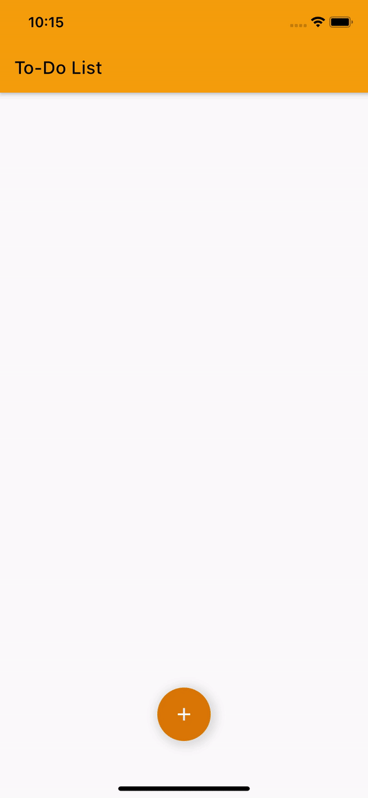

# Etiqa To-Do List App (Provider)

  

Mobile App Developer Assessment by Etiqa IT.
Building an To-Do List App with Provider.

### ⚡&ensp;Social Media

&ensp;Linkedin: [@ZarithSofian](https://linkedin.com/in/zarith-sofian-jumaat-81ba3b186 'Linkedin Zarith Sofian')

### ✌&ensp;Preview

|                                                  App Preview                                                  |
| :-----------------------------------------------------------------------------------------------------------: |
|  |
